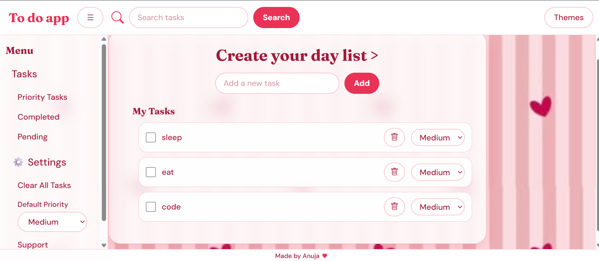

# 📝 To Do App

A full-stack to-do list app. The frontend is built from scratch with vanilla JavaScript, HTML and CSS — no frameworks — and talks to a Node.js / Express REST API that stores tasks in MongoDB Atlas. Built as a hands-on learning project to practice DOM manipulation, state management, an MVC-style code structure, `fetch` with `async` / `await`, and REST API design.

<!-- Live demo: add the link here after deploying -->

## Screenshot



## Features

- Add, complete, and delete tasks
- Tasks are saved in MongoDB, so they are still there after a page refresh
- Priority levels (High / Medium / Low) per task, with a one-click sort by priority
- Search tasks in real time
- Filter by Completed / Pending
- Settings
  - Clear all tasks (with confirmation)
  - Set a default priority for new tasks
  - Support / FAQ panel
- Theming — Light, Dark, Pink, and System (follows OS preference), saved across sessions
- Responsive, animated UI — glass-panel cards, smooth dropdowns, task pop-in animations, and full support for reduced-motion preferences

## Tech Stack

**Frontend**

- HTML5 / CSS3 — custom properties (CSS variables) drive all theming
- Vanilla JavaScript (ES Modules) — no build step required
- Google Fonts — Fraunces (headings) and DM Sans (body)

**Backend**

- Node.js and Express
- MongoDB (Atlas) with Mongoose
- dotenv for environment variables, cors for cross-origin requests

## How It Works

```
Browser (frontend) -> Express routes -> Controllers -> Mongoose model -> MongoDB Atlas
       <------------------------ JSON response <------------------------
```

## Project Structure

```
BasicVersion/
├── index.html
├── style.css
├── js/
│   ├── main.js                 # entry point — initializes all controllers
│   ├── taskModel.js            # task data + API calls to the backend (no DOM)
│   ├── taskView.js             # DOM rendering for tasks
│   ├── taskController.js       # task-related event listeners
│   ├── themeController.js      # theme switching logic
│   └── settingsController.js   # settings dropdown, clear-all, default priority, FAQ
├── server/
│   ├── config/db.js            # MongoDB connection
│   ├── models/Task.js          # Mongoose task schema
│   ├── controllers/taskController.js  # request handlers
│   ├── routes/taskRoutes.js    # URL -> handler mapping
│   └── server.js               # Express entry point
└── README.md
```

The frontend follows a lightweight MVC pattern:

- Model (`taskModel.js`) owns the task data and talks to the API with `fetch`
- View (`taskView.js`) owns rendering tasks to the DOM
- Controllers (`taskController.js`, `themeController.js`, `settingsController.js`) wire up event listeners and connect model to view

The backend follows the same idea: a Mongoose model, controllers that handle requests, and routes that map URLs to controllers.

## API Reference

Base URL: `http://localhost:5000/api/tasks`

| Method | Endpoint | Description |
| ------ | -------- | ----------- |
| GET | `/api/tasks` | Get all tasks |
| POST | `/api/tasks` | Create a task |
| PATCH | `/api/tasks/:id` | Update a task (text, completed or priority) |
| DELETE | `/api/tasks/:id` | Delete one task |
| DELETE | `/api/tasks` | Delete all tasks |

Example request body for `POST /api/tasks`:

```json
{
  "text": "Buy groceries",
  "priority": "High"
}
```

### Task model

| Field | Type | Notes |
| ----- | ---- | ----- |
| `text` | String | Required |
| `completed` | Boolean | Defaults to `false` |
| `priority` | String | `High`, `Medium` or `Low`. Defaults to `Medium` |
| `createdAt`, `updatedAt` | Date | Added automatically |

## Getting Started

You need Node.js and a MongoDB database (a free MongoDB Atlas cluster, or a local MongoDB).

### 1. Clone the repository

```
git clone <your-repo-url>
cd <your-repo-folder>
```

### 2. Run the backend

```
cd server
npm install
```

Create a file named `.env` inside `server/`:

```
MONGO_URI=mongodb+srv://<db_username>:<db_password>@<your-cluster>.mongodb.net/ToDoApp?retryWrites=true&w=majority
PORT=5000
```

Use your own Atlas connection string for `MONGO_URI`. For a local MongoDB, use `mongodb://localhost:27017/ToDoApp` instead. The `.env` file is ignored by git, so your credentials stay private.

Then start the server:

```
node server.js
```

You should see `Server running on port 5000` and `MongoDB connected`.

### 3. Run the frontend

Because the app uses ES Modules (`import`/`export`), it must be run through a local server — opening `index.html` directly (`file://`) will not work due to browser CORS restrictions on modules.

**Option 1 — VS Code Live Server**

1. Install the Live Server extension
2. Right-click `index.html` → Open with Live Server

**Option 2 — `serve`**

```
npx serve
```

Then open the printed `http://localhost:...` URL in your browser.

The frontend calls the API at `http://localhost:5000/api/tasks`. If your backend runs somewhere else, change `API_URL` near the top of `js/taskModel.js`.

## Roadmap

- Deploy the app online (MongoDB Atlas, a hosted backend and a static frontend host)
- User accounts (login/signup) and per-user task lists — planned as a v2 feature

## Author

Made by Anuja ❤️